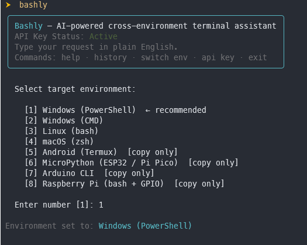
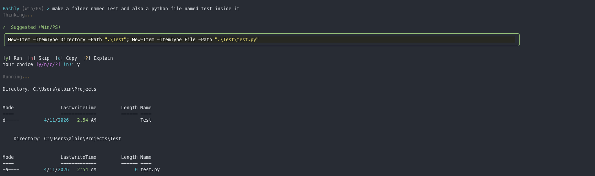

# Bashly

[](https://pypi.org/project/bashly-cli/)
[](https://pypi.org/project/bashly-cli/)
[](https://github.com/albinnnnn/bashly/blob/main/LICENSE)

An AI-powered terminal assistant that translates plain English into safe, executable shell commands across eight environments. Bashly uses AI models via OpenRouter (free tier available).



---

## Why Bashly?

**Natural language input.** Describe the operation in plain English and receive the exact command, arguments, and flags — without leaving the terminal.

**Cross-environment.** Switch between PowerShell, CMD, Bash, zsh, Termux, MicroPython, Arduino, and Raspberry Pi from a single session.

**Safe by design.** Regex-based danger detection classifies every command before execution. Destructive patterns are blocked outright.

**Explicit confirmation.** Bashly never executes a command without user approval. Commands can be run locally, copied for remote systems, or explained on request.



---

## Supported Environments

Bashly auto-detects your OS and distinguishes between PowerShell and CMD on Windows.

| Environment | Run locally |
|---|---|
| Windows — PowerShell | Yes |
| Windows — CMD | Yes |
| Linux — bash | Yes |
| macOS — zsh | Yes |
| Android — Termux | Copy only |
| MicroPython — ESP32 / Pi Pico | Copy only |
| Arduino CLI | Copy only |
| Raspberry Pi — bash + GPIO | Copy only |

---

## Quick Start

**1. Install from PyPI:**

```bash
pip install bashly-cli
```

**2. Run:**

```bash
bashly
```

**3. First-time setup:**

On first launch, Bashly will prompt for an **OpenRouter API key**. Get one at [openrouter.ai](https://openrouter.ai) (free tier available), paste it when prompted, and it will be saved to `~/.bashly_config.json`.

---

## Usage

Bashly runs as a persistent session inside your terminal. Describe the desired operation in plain English:

```
Bashly (Linux)   > find all log files older than 7 days
Bashly (Win/PS)  > list running processes sorted by memory usage
Bashly (MicroPy) > blink the onboard LED every 500ms
```

### Built-in Commands

| Command | Action |
|---|---|
| `help` | Show the help menu |
| `history` | View your last 10 commands |
| `clear history` | Delete saved command history |
| `sysinfo` | View system information |
| `api key` | Update your OpenRouter API key |
| `switch env` | Change target environment |
| `exit` | Quit Bashly |

### Interactive Approvals

Bashly requires explicit confirmation before running any command.

**Local environments:**

| Key | Action |
|---|---|
| `y` | Run the command |
| `n` | Skip |
| `c` | Copy to clipboard |
| `?` | Explain what it does |

**Remote / embedded targets:**

| Key | Action |
|---|---|
| `y` or `c` | Copy to clipboard |
| `?` | Explain what it does |

---

## Security Model

Every command is classified before execution:

| Level | Behaviour |
|---|---|
| Dangerous | Destructive patterns (`rm -rf`, `format c:`, `dd if=`) are blocked and never executed |
| Caution | Elevated commands (`sudo`, `chmod`, registry writes) are allowed with a visible warning |
| Safe | Standard read/query commands proceed normally through the approval flow |

---

## Contributing

```bash
git clone https://github.com/albinnnnn/bashly
cd bashly
pip install -e .
```

Prompts live in `src/bashly/prompts.py`. Project structure:

```
bashly/
├── src/bashly/
│   ├── cli.py            # entry point & REPL loop
│   ├── llm.py            # OpenRouter API client
│   ├── executor.py       # command runner & approval flow
│   ├── history.py        # session history
│   ├── environments.py   # env detection & definitions
│   ├── prompts.py        # system prompts ← edit here
│   └── config.py         # API key & settings
├── pyproject.toml
└── README.md
```

---

## License

MIT © [albinnnnn](https://github.com/albinnnnn)
